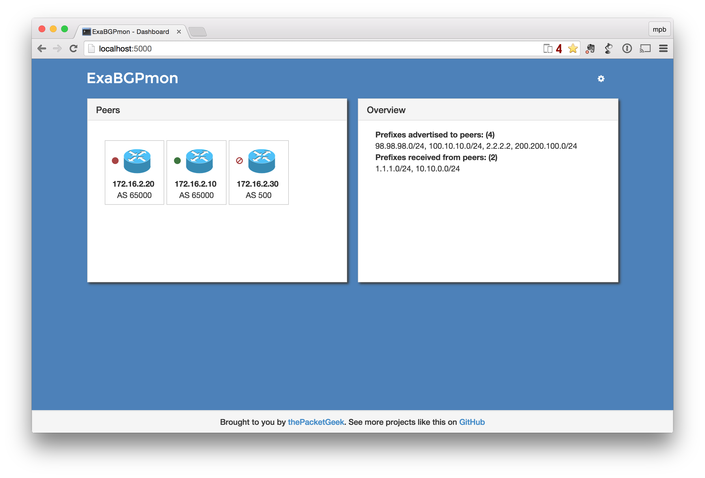
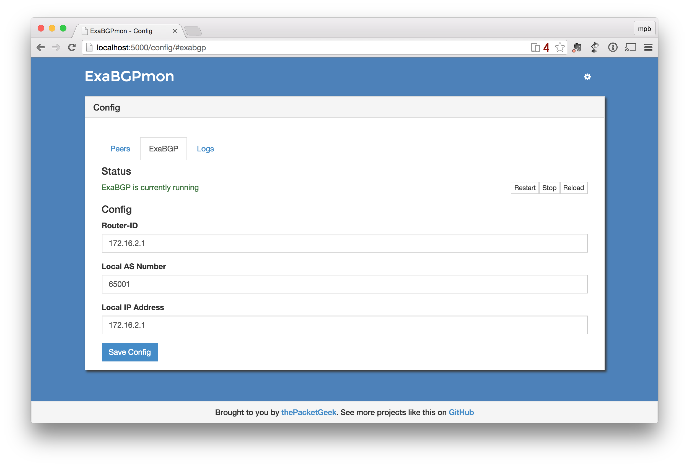

# ExaBGPmon
An HTTP frontend to the glorious ExaBGP

### Features
* Configure ExaBGP and auto-generate a config file
* Monitor and manage peers
	* Control routes advertised
    * Automatically re-advertise when ExaBGP or peer comes back online
* View prefixes received from peers




## Install ExaBGPmon DEV
	git clone https://github.com/DDecoene/ExaBGPmon.git
	cd ExaBGPmon
	vagrant up

* Done!

* Point your browser to `http://localhost:5000` and see ExaBGPmon in action
* MongoDB is exposed to the host on port 27017.
* You **could** also edit the Vagrantfile so that you do not start from the box I included by changing the relevant commented lines.
	* Change:
	
    ```
    config.vm.box = "exaBGPmon"
    config.vm.box_url="file://exaBGPmon.box"
    #config.vm.box = "ubuntu/trusty64"
    ```
   
    * To:
    
    ```
    #config.vm.box = "exaBGPmon"
    #config.vm.box_url="file://exaBGPmon.box"
    config.vm.box = "ubuntu/trusty64"
    ```
    
    You **could** do this if you don't trust the contents of the box file. I only included it to reduce startup time, it will completely rebuild if you want to start with the ubuntu/trusty64 box. You only need to comment out `listen 127.0.0.1` in `/etc/mongodb.conf` if you would like to expose MongoDB to the host.
    


